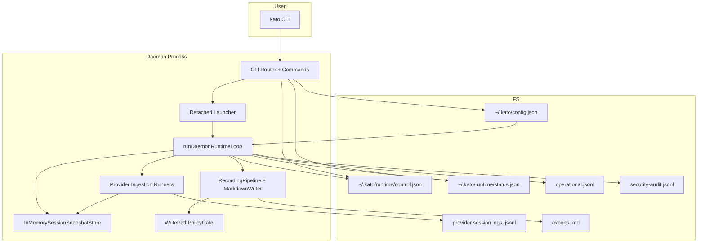

## Purpose

This note explains Kato's architecture at the component and subsystem level:

- each component's responsibilities
- where state lives (source-of-truth boundaries)
- how data and control move through the system
- which modules depend on which others

For implementation constraints and security invariants, also see:

- [[dev.general-guidance]]
- [[dev.security-baseline]]
- [[dev.deno-daemon-implementation]]

## Core Vocabulary

- **Daemon**: long-running subprocess (`kato __daemon-run`) that ingests
  provider logs, handles queued control commands, and updates runtime status.
- **Provider**: external conversation source (currently `claude`, `codex`)
  represented as session log files under configured roots.
- **Session**: one provider conversation identified by a provider-specific
  `sessionId`.
- **Runtime session snapshot**: normalized in-memory state for a session
  (provider, cursor, bounded messages, status metadata). This is the canonical
  runtime state for export and provider status.
- **Control plane**: filesystem IPC boundary between CLI and daemon:
  `control.json` (requests) and `status.json` (daemon snapshot).
- **Recording/writer pipeline**: module chain that converts snapshots/messages
  into markdown output and applies write policy checks.
- **Policy layer**: command and path gates that enforce fail-closed behavior
  before mutation actions.

## Monorepo Boundaries

- `shared/src`: contracts used across app boundaries (`config`, `status`,
  `messages`, `ipc`).
- `apps/daemon/src`: the operational system (CLI + launcher + runtime).
- `apps/web/src`: placeholder for read-only status surfaces.
- `apps/cloud/src`: placeholder for centralized control/aggregation surfaces.
- `tests`: contract and behavior tests mapped to daemon modules.

## Topology

## Responsibility Map

| Area            | Primary responsibility                           | Owns state                    | Reads from                           | Writes to                    | Key modules                                          |
| --------------- | ------------------------------------------------ | ----------------------------- | ------------------------------------ | ---------------------------- | ---------------------------------------------------- |
| CLI surface     | Parse commands and dispatch behavior             | none                          | argv, config, status/control         | control queue, stdout/stderr | `apps/daemon/src/cli/*`                              |
| Launcher        | Start daemon with narrowed permissions           | none                          | runtime config                       | child process spawn          | `apps/daemon/src/orchestrator/launcher.ts`           |
| Config          | Validate and default runtime config              | config schema rules           | `~/.kato/config.json`, env           | `~/.kato/config.json`        | `apps/daemon/src/config/runtime_config.ts`           |
| Runtime loop    | Main orchestrator event loop                     | live runtime snapshot object  | control queue, ingestion results     | status snapshot, logs        | `apps/daemon/src/orchestrator/daemon_runtime.ts`     |
| Ingestion       | Discover/watch/parse provider session files      | provider cursors + dirty sets | provider roots, parser output        | session snapshot store, logs | `apps/daemon/src/orchestrator/provider_ingestion.ts` |
| Snapshot store  | Canonical session state for runtime              | per-session snapshots         | ingestion upserts                    | in-memory list/get responses | `apps/daemon/src/orchestrator/ingestion_runtime.ts`  |
| Writer pipeline | Render/export markdown with dedupe/path gates    | active recordings map         | export requests + snapshots          | markdown files, logs         | `apps/daemon/src/writer/*`                           |
| Policy          | Deny/allow write destinations, command detection | none                          | config + command text                | decisions/events             | `apps/daemon/src/policy/*`                           |
| Observability   | structured operational + audit records           | none                          | events from runtime/ingestion/writer | JSONL sinks                  | `apps/daemon/src/observability/*`                    |

## Daemon Subsystems

### 1) CLI, Router, and Command Handlers

`runDaemonCli` in `apps/daemon/src/cli/router.ts` is the CLI coordinator:

1. parse intent (`start`, `status`, `export`, etc.)
2. load/initialize runtime config (`kato init`, optional auto-init on start)
3. build command context (stores, launcher, policy gate, loggers)
4. call command-specific handler

Command handlers do not run daemon business logic directly; they manipulate the
control plane and rely on the daemon runtime to execute queued work.

### 2) Detached Launcher and Permission Envelope

`DenoDetachedDaemonLauncher` computes scoped read/write roots before spawning:

- write scope: `allowedWriteRoots` + runtime/control/status/config parents
- read scope: write scope + `providerSessionRoots`

This makes the long-lived daemon process narrower than a broad `-A` profile.

### 3) Runtime Loop (Orchestrator)

`runDaemonRuntimeLoop` is the central scheduler:

1. initialize status snapshot (`daemonRunning: true`)
2. start ingestion runners
3. each poll cycle:
   - poll ingestion runners
   - consume control requests from queue
   - update recording summary
   - on heartbeat boundary, recompute provider status and persist `status.json`
4. stop ingestion runners on shutdown
5. write terminal status (`daemonRunning: false`)

Important: provider status aggregation is heartbeat-scoped (not every poll) to
avoid unnecessary full snapshot cloning on hot loops.

### 4) Ingestion Pipeline

Provider ingestion runners are created by
`createDefaultProviderIngestionRunners(...)` with config-supplied roots.

Per runner responsibilities:

- discover session files from provider roots
- watch filesystem changes with debounce
- maintain in-memory cursor map per session
- parse new log content from last cursor
- merge/dedupe messages against existing snapshot
- upsert into shared snapshot store
- emit operational and audit events for starts/errors/cursor updates/drops

### 5) Snapshot Store and State Semantics

`InMemorySessionSnapshotStore` is runtime canonical state for session data:

- bounded by retention policy (`maxSessions`, `maxMessagesPerSession`)
- upsert is copy-safe (clones inputs/outputs)
- metadata carries:
  - `updatedAt` (ingestion-time)
  - `messageCount`
  - `truncatedMessages`
  - optional `lastMessageAt`

`status.providers` is derived from this store, not from parser internals.

### 6) Export/Writer Path

`export` command flow:

1. CLI enqueues request in `control.json`
2. runtime loop reads request
3. runtime resolves snapshot via `loadSessionSnapshot`
4. writer pipeline enforces path policy
5. markdown writer renders and writes output
6. control request is marked processed

If snapshot is missing/invalid/empty, runtime skips export with explicit
operational + audit events (fail-safe behavior, no silent empty file writes).

### 7) Policy and Security Gates

Two active policy surfaces:

- command policy (`::...` detection/parsing contracts)
- write policy (canonical path checks + allowed root enforcement)

Read scoping is enforced at process-launch permission envelope level, while
write scoping is enforced both at permission envelope and policy gate layers.

### 8) Observability

The daemon emits two channels with independent sinks:

- `operational` for system behavior and errors
- `security-audit` for control, policy, and security-relevant events

Runtime startup wires JSONL file sinks under `<runtimeDir>/logs`.

## Source-of-Truth Boundaries

- `config.json`: canonical runtime settings and policy-relevant roots/flags.
- `control.json`: canonical queued daemon commands from CLI.
- `status.json`: canonical externally readable daemon status snapshot.
- in-memory snapshot store: canonical live session state while daemon runs.
- exported markdown: derived artifact, never the runtime source of truth.

## Key Interaction Flows

### Ingestion to Status Flow

1. provider file changes
2. runner parses incremental messages
3. snapshot store upsert
4. heartbeat recompute of provider aggregates
5. write `status.json`

### Ingestion to Export Flow

1. snapshot store updated by ingestion
2. user runs `kato export <sessionId>`
3. runtime resolves snapshot
4. writer pipeline renders + writes output

### CLI Stop and Stale Recovery

1. `kato stop` queues stop request when daemon alive
2. runtime consumes stop and shuts down cleanly
3. if daemon is stale/dead, CLI stale-status handling resets status file

## Test Coverage by Concern

- CLI contracts and control-plane behavior: `tests/daemon-cli_test.ts`
- launcher permission wiring: `tests/daemon-launcher_test.ts`
- runtime loop orchestration and export/status semantics:
  `tests/daemon-runtime_test.ts`
- ingestion runner behavior: `tests/provider-ingestion_test.ts`
- snapshot store semantics: `tests/daemon-ingestion-runtime_test.ts`
- config parsing/defaulting/fail-closed behavior: `tests/runtime-config_test.ts`
- parser fixtures: `tests/claude-parser_test.ts`, `tests/codex-parser_test.ts`
- write policy enforcement: `tests/path-policy_test.ts`

## Extension Guide

To add a new provider:

1. add parser under `apps/daemon/src/providers/<provider>/`
2. add provider root in `providerSessionRoots` contract/defaults
3. add ingestion runner factory wiring
4. add provider fixture + ingestion tests
5. verify launcher read-scope includes new provider roots

To add a new control command:

1. extend CLI parser/usage/command type
2. enqueue payload in control plane
3. implement runtime handling + logging/audit events
4. add runtime and CLI tests for success + fail-closed cases

## Current MVP Limits

- provider cursors are in-memory only; daemon restart replays from offset `0`
  and relies on dedupe for suppression.
- control plane is file-based local IPC; no remote orchestration yet.
- service-manager integration (systemd/launchd/windows service) is deferred.
