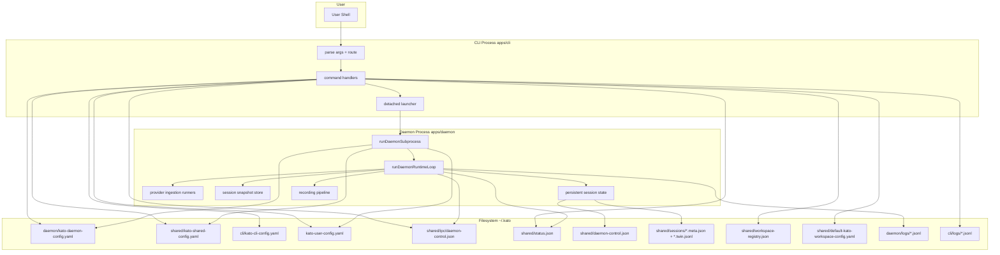

## Purpose

This note explains Kato's current architecture after CLI/daemon separation:

- process and package boundaries
- ownership of config/state files
- control/data flow between CLI and daemon
- where to extend behavior safely

Related notes:

- [[dev.general-guidance]]
- [[dev.security-baseline]]
- [[dev.deno-daemon-implementation]]

## Core Vocabulary

- **CLI process**: short-lived command process (`apps/cli`) that parses user
  intent and reads/writes config, status, and control-plane files.
- **Daemon process**: long-running ingest/export orchestrator (`apps/daemon`)
  launched by CLI and acknowledged via status heartbeat.
- **Runtime library**: shared Deno implementation package (`apps/runtime`) used
  by both CLI and daemon (stores, resolvers, policy, observability).
- **Contracts library**: pure shared contracts (`shared/src`) used across app
  boundaries.
- **Control plane**: file-based IPC between CLI and daemon:
  `~/.kato/shared/ipc/daemon-control.json` (requests) and
  `~/.kato/shared/status.json` (status snapshot).
- **Provider session**: provider conversation identity
  (`provider + providerSessionId`) used as the durable state key.
- **Source file**: provider transcript file discovered by ingestion
  (`sourceFilePath`) and parsed into canonical events.
- **Session metadata**: durable per-provider-session state (`*.meta.json`) with
  ingest cursor, dedupe fingerprints, command cursor/anchor, and recording
  bindings.
- **SessionTwin**: canonical per-provider-session event log (`*.twin.jsonl`) for
  replay and durable cursor/write state.
- **Runtime snapshot**: bounded in-memory projection of parsed events used by
  status, in-chat command handling, and export.
- **First-seen provider session**: daemon has no prior command cursor/anchor
  state for that provider session key.
- **First-seen source file**: source file newly observed/fresh by filesystem
  signals; not equivalent to first-seen provider session.

## Monorepo Boundaries

- `apps/cli/src`: command parser/router and command handlers.
- `apps/daemon/src`: daemon bootstrap + orchestrator + provider parsers.
- `apps/runtime/src`: shared Deno runtime modules (config stores/path
  resolvers/control-plane/policy/workspace/observability).
- `shared/src`: contracts and projection utilities (`config`, `status`,
  `session_state`, `events`, `messages`, `ipc`, etc.).
- `apps/web/src`, `apps/cloud/src`: placeholders.
- `tests`: behavior and contract coverage.

## Default Filesystem Layout

- `~/.kato/kato-user-config.yaml`
- `~/.kato/shared/kato-shared-config.yaml`
- `~/.kato/shared/status.json`
- `~/.kato/shared/ipc/daemon-control.json`
- `~/.kato/shared/daemon-control.json` (rebuildable session index cache)
- `~/.kato/shared/sessions/*.meta.json`
- `~/.kato/shared/sessions/*.twin.jsonl`
- `~/.kato/shared/workspace-registry.json`
- `~/.kato/shared/default-kato-workspace-config.yaml`
- `~/.kato/daemon/kato-daemon-config.yaml`
- `~/.kato/daemon/logs/operational.jsonl`
- `~/.kato/daemon/logs/security-audit.jsonl`
- `~/.kato/cli/kato-cli-config.yaml`
- `~/.kato/cli/logs/operational.jsonl`
- `~/.kato/cli/logs/security-audit.jsonl`

Workspace-local config remains `<workspace>/.kato-workspace-config.yaml`.
Captured/exported conversation files are workspace-root data and do not belong
under `~/.kato` by default.
Generated defaults derived from workspace `defaultOutputDir` remain
workspace-root-contained after template expansion; only explicit command paths
may target outside the workspace root.

## Topology

```mermaid
graph TD
  subgraph User
    U[User Shell]
  end

  subgraph CLIProcess[CLI Process apps/cli]
    PARSE[parse args + route]
    CMDS[command handlers]
    LCH[detached launcher]
  end

  subgraph DaemonProcess[Daemon Process apps/daemon]
    MAIN[runDaemonSubprocess]
    LOOP[runDaemonRuntimeLoop]
    INGEST[provider ingestion runners]
    SNAP[session snapshot store]
    PERSIST[persistent session state]
    WRITE[recording pipeline]
  end

  subgraph FS[Filesystem ~/.kato]
    DCFG[daemon/kato-daemon-config.yaml]
    SHCFG[shared/kato-shared-config.yaml]
    CCFG[cli/kato-cli-config.yaml]
    UCFG[kato-user-config.yaml]
    CTRL[shared/ipc/daemon-control.json]
    STAT[shared/status.json]
    SIDX[shared/daemon-control.json]
    SESS[shared/sessions/*.meta.json + *.twin.jsonl]
    WREG[shared/workspace-registry.json]
    WTPL[shared/default-kato-workspace-config.yaml]
    DLOG[daemon/logs/*.jsonl]
    CLOG[cli/logs/*.jsonl]
  end

  U --> PARSE
  PARSE --> CMDS
  CMDS --> DCFG
  CMDS --> SHCFG
  CMDS --> CCFG
  CMDS --> UCFG
  CMDS --> WREG
  CMDS --> WTPL
  CMDS --> CTRL
  CMDS --> STAT
  CMDS --> CLOG
  CMDS --> LCH

  LCH --> MAIN
  MAIN --> DCFG
  MAIN --> SHCFG
  MAIN --> UCFG
  MAIN --> LOOP

  LOOP --> INGEST
  LOOP --> SNAP
  LOOP --> PERSIST
  LOOP --> WRITE
  LOOP --> CTRL
  LOOP --> STAT
  PERSIST --> SESS
  PERSIST --> SIDX
  LOOP --> DLOG
```

## Responsibility Map

| Area                | Primary responsibility                                                                             | Key modules                                            |
| ------------------- | -------------------------------------------------------------------------------------------------- | ------------------------------------------------------ |
| CLI surface         | Parse commands, load/init CLI+daemon+shared config, enqueue control requests, render status        | `apps/cli/src/*`                                       |
| Launcher            | Spawn daemon with narrowed read/write permissions and env overrides                                | `apps/runtime/src/orchestrator/launcher.ts`            |
| Daemon bootstrap    | Load daemon/shared/user config, init loggers/stores, enter runtime loop                            | `apps/daemon/src/main.ts`                              |
| Control plane       | Persist/list/mark control requests, persist/load status snapshots                                  | `apps/runtime/src/orchestrator/control_plane.ts`       |
| Ingestion           | Discover/watch provider source files, parse incremental events, project provider-session snapshots | `apps/daemon/src/orchestrator/provider_ingestion.ts`   |
| Session persistence | Authoritative provider-session metadata/twin writes and rebuildable daemon index cache             | `apps/runtime/src/orchestrator/session_state_store.ts` |
| Writer pipeline     | Render markdown/jsonl with policy gate enforcement                                                 | `apps/daemon/src/writer/*`                             |
| Workspace layer     | Registry + workspace profile/template resolution                                                   | `apps/runtime/src/workspace/*`                         |
| Observability       | Structured operational/audit events for CLI and daemon                                             | `apps/runtime/src/observability/*`                     |

## Daemon Subsystems

### 1) CLI Router and Command Handlers

`runDaemonCli` in `apps/cli/src/router.ts` coordinates:

1. parse intent
2. load/initialize daemon/shared/cli config stores
3. build command context (stores, launcher, policy gate, loggers)
4. dispatch command handler

Most commands enqueue control requests or read status. `clean` is CLI-owned and
executes immediately.

### 2) Detached Launcher Permission Envelope

`DenoDetachedDaemonLauncher` computes runtime-scoped permission roots:

- write: allowed write roots + runtime/config/status/control parents
- read: write roots + daemon source/import roots + `~/.kato` user config dir +
  provider session roots

This keeps the daemon process scoped tighter than broad `-A`.

### 3) Runtime Loop

`runDaemonRuntimeLoop`:

1. marks daemon running in status
2. starts ingestion runners
3. on each poll cycle:
   - polls ingestion
   - applies in-chat command updates
   - consumes control queue requests
   - updates recording summary
   - persists heartbeat/status snapshot
4. stops ingestion and writes terminal status

### 4) Ingestion and Snapshot Projection

Ingestion runners:

- discover/watch provider source files
- resume by provider session identity + persisted cursor
- parse incremental events
- append SessionTwin with bounded dedupe
- persist metadata and project into in-memory snapshot store

Hot paths use `listMetadataOnly()` to avoid deep-cloning event arrays.

### Naming Guardrail

- Use **provider session** for identity/cursor/anchor state.
- Use **source file** for filesystem freshness (`birthtime`/`mtime`) and parser
  input context.
- Avoid plain **session** in new replay/freshness comments when it could mean
  either provider-session identity or source-file state.

### 5) Export/Writer Path

`kato export` flow:

1. CLI enqueues `export` request into shared control queue
2. daemon resolves session snapshot
3. writer pipeline enforces path policy
4. writer emits markdown or JSONL
5. request is marked processed

Missing/invalid/empty snapshots fail safe (no silent empty writes).

## Source-of-Truth Boundaries

- `~/.kato/daemon/kato-daemon-config.yaml`: daemon process settings.
- `~/.kato/shared/kato-shared-config.yaml`: shared policy + plain export
  defaults.
- `~/.kato/cli/kato-cli-config.yaml`: CLI-only settings (currently logging).
- `~/.kato/shared/ipc/daemon-control.json`: queued daemon commands.
- `~/.kato/shared/status.json`: externally readable daemon status snapshot.
- provider source files (Codex/Claude/Gemini transcript files): external inputs,
  not authoritative control state.
- `~/.kato/shared/sessions/*.meta.json` + `*.twin.jsonl`: durable session state.
- in-memory snapshot store: runtime projection cache.
- markdown/jsonl exports: derived artifacts.

## Extension Guide

To add a provider:

1. add parser under `apps/daemon/src/providers/<provider>/`
2. add provider root in daemon config defaults/contracts
3. wire ingestion runner factory
4. add parser + ingestion tests
5. verify launcher read-scope includes provider roots

To add a control command:

1. extend CLI parser/intent/usage
2. enqueue typed payload to control plane
3. implement daemon runtime handling + audit/operational events
4. add CLI + daemon loop tests for success and fail-closed paths

## Current Limits

- control plane is local file IPC; no remote orchestration
- service-manager integration is deferred
- queue hardening beyond single-file JSON is tracked separately
