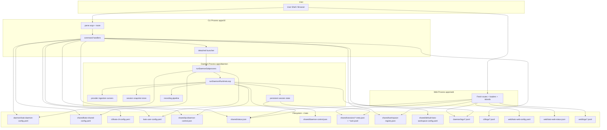

## Purpose

This note explains Kato's current architecture after CLI/daemon/web separation:

- process and package boundaries
- ownership of config/state files
- control/data flow between CLI, web, and daemon
- where to extend behavior safely

Related notes:

- [[dev.general-guidance]]
- [[dev.security-baseline]]
- [[dev.deno-daemon-implementation]]

## Core Vocabulary

- **CLI process**: short-lived command process (`apps/cli`) that parses user
  intent and reads/writes config, status, and control-plane files.
- **Daemon process**: long-running ingest/export orchestrator (`apps/daemon`)
  launched by CLI and acknowledged via status heartbeat.
- **Web app process**: local authenticated operator console (`apps/web`) that
  renders browser views from status/config/session/log stores and owns a small
  set of guided local workflows.
- **Runtime library**: shared Deno implementation package (`apps/runtime`) used
  by both CLI and daemon (stores, resolvers, policy, observability).
- **Contracts library**: pure shared contracts (`shared/src`) used across app
  boundaries.
- **Control plane**: file-based IPC between CLI and daemon:
  `~/.kato/shared/ipc/daemon-control.json` (requests) and
  `~/.kato/shared/status.json` (status snapshot).
- **Provider session**: provider conversation identity
  (`provider + providerSessionId`) used as the durable state key.
- **Source file**: provider transcript file discovered by ingestion
  (`sourceFilePath`) and parsed into canonical events.
- **Session metadata**: durable per-provider-session state (`*.meta.json`) with
  ingest cursor, dedupe fingerprints, command cursor/anchor, and recording
  bindings.
- **SessionTwin**: canonical per-provider-session event log (`*.twin.jsonl`) for
  replay and opt-in persisted conversation history.
- **Runtime snapshot**: bounded in-memory projection of parsed events used by
  status, in-chat command handling, and export.
- **First-seen provider session**: daemon has no prior command cursor/anchor
  state for that provider session key.
- **First-seen source file**: source file newly observed/fresh by filesystem
  signals; not equivalent to first-seen provider session.

## Monorepo Boundaries

- `apps/cli/src`: command parser/router and command handlers.
- `apps/daemon/src`: daemon bootstrap + orchestrator + provider parsers.
- `apps/runtime/src`: shared Deno runtime modules (config stores/path
  resolvers/control-plane/policy/workspace/observability).
- `shared/src`: contracts and projection utilities (`config`, `status`,
  `session_state`, `events`, `messages`, `ipc`, etc.).
- `apps/web`: local Fresh-based operator console (routes, loaders, API
  handlers, islands, auth/session handling, and small guided workflows).
- `apps/cloud/src`: placeholder.
- `tests`: behavior and contract coverage.

## Web Route Map

Current top-level web routes are:

- `/`: Summary dashboard. Server-rendered first paint plus the `SummaryLive`
  island, backed by `loadSummaryPageData()` and `/api/summary`.
- `/sessions`: primary discovered chat-session inventory, backed by
  `loadSessionsPageData()` and `/api/sessions`, with live activity,
  recording state, and on-demand snippet reveal.
- `/recordings`: latest recording-output state across sessions and workspaces
  (one row per output file, with stop / same-path `Re-start` for persisted
  rows), backed by `loadRecordingsPageData()` and `/api/recordings`.
- `/workspaces`: workspace register/unregister, operator-facing display-label
  editing, registration-time display-label entry, per-workspace
  preferred-username overrides, plus workspace-level recording rollups, backed
  by `loadWorkspacesPageData()` and `/api/workspaces`.
- `/logs`: combined daemon + web operational/security log view with shared
  filter semantics, backed by `loadLogPageData()` and `/api/logs`.
- `/settings`: guided user-default and workspace-username mapping workflows.
- `/maintenance`: guided cleanup workflows for logs and old derived session
  artifacts, plus the persisted twin troubleshooting/cleanup surface backed by
  `loadMaintenanceTwinsData()` and `/api/maintenance-twins`.
- `/login` and `/logout`: local auth/session entry points.

Supporting web files worth knowing:

- `apps/web/src/loaders/*`: filesystem-backed read models used by routes and API
  handlers.
- `apps/web/src/session_recording_actions.ts`: shared web mutation flows for
  Sessions and Recordings recording/capture start-stop-`Re-start` actions,
  including same-file exclusivity guards.
- `apps/web/src/session_routes.ts`: canonical href builders for
  `/maintenance`, `/sessions`, and session anchor links.
- `apps/web/src/live_routes.ts`: shared live JSON handlers for
  `/api/chrome-status`, `/api/summary`, `/api/maintenance-twins`,
  `/api/sessions`, `/api/recordings`, `/api/session-snippet`,
  `/api/workspaces`, and `/api/logs`.
- `apps/web/routes/api/*`: thin route entrypoints that delegate to
  `apps/web/src/live_routes.ts`.
- `apps/web/src/api_response.ts`: shared no-store response helper for live JSON
  endpoints.
- `apps/web/src/session_snippets.ts`: shared on-demand snippet resolution from
  live snapshot, twin replay, or explicit provider-source replay.

## Default Filesystem Layout

- `~/.kato/kato-user-config.yaml`
- `~/.kato/shared/kato-shared-config.yaml`
- `~/.kato/shared/status.json`
- `~/.kato/shared/ipc/daemon-control.json`
- `~/.kato/shared/daemon-control.json` (rebuildable session index cache)
- `~/.kato/shared/sessions/*.meta.json`
- `~/.kato/shared/sessions/*.twin.jsonl`
- `~/.kato/shared/workspace-registry.json`
- `~/.kato/shared/default-kato-workspace-config.yaml`
- `~/.kato/daemon/kato-daemon-config.yaml`
- `~/.kato/daemon/logs/operational.jsonl`
- `~/.kato/daemon/logs/security-audit.jsonl`
- `~/.kato/cli/kato-cli-config.yaml`
- `~/.kato/cli/logs/operational.jsonl`
- `~/.kato/cli/logs/security-audit.jsonl`
- `~/.kato/web/kato-web-config.yaml`
- `~/.kato/web/kato-web-status.json`
- `~/.kato/web/logs/operational.jsonl`
- `~/.kato/web/logs/security-audit.jsonl`

The web config stores the preferred local host/port. `kato web start` selects
the effective port at launch time, scanning upward when the preferred port is
already in use; under WSL it also performs a best-effort Windows localhost
listener probe for browser-visible port conflicts. The web status file is the
source of truth for the actual running or stale web URL.

Workspace-local config remains `<workspace>/.kato-workspace-config.yaml`.
Captured/exported conversation files are workspace-root data and do not belong
under `~/.kato` by default.
Generated defaults derived from workspace `defaultOutputDir` remain
workspace-root-contained after template expansion; only explicit command paths
may target outside the workspace root.
Workspace-local `workspaceFeatureFlags` also carry recording-render policy,
including default-on relative sanitization for absolute local inline markdown
destinations plus an optional Dendron wikilink rewrite for local `.md` note
links in workspace-scoped markdown output. Dendron rewriting is vault-aware:
runtime discovery walks upward from the final output path to a matching
`dendron.yml`, derives `wikilinkifiableRoots` from its mounted vaults, and
falls back to the output file's own directory when no Dendron context matches.
When a recording append touches an existing markdown file, the writer also
normalizes the already-written body through that same link-policy pass so
legacy standard note links collapse to Dendron wikilinks once the workspace
flag is enabled. Twins and persisted source/history snapshots stay
authoritative. The Workspaces page exposes the matched
`dendron.yml` path plus the derived roots as read-only diagnostics for the
workspace default output location.
Operator-facing workspace `displayName` labels live in the shared workspace
registry, while preferred per-workspace participant usernames remain in
`kato-user-config.yaml`.

## Topology

## Responsibility Map

| Area                | Primary responsibility                                                                                 | Key modules                                            |
| ------------------- | ------------------------------------------------------------------------------------------------------ | ------------------------------------------------------ |
| CLI surface         | Parse commands, load/init CLI+daemon+shared config, enqueue control requests, render status            | `apps/cli/src/*`                                       |
| Web app             | Render authenticated operator views, serve local JSON endpoints, and run small guided workflows        | `apps/web/{routes,islands,src}/*`                      |
| Launcher            | Spawn daemon with narrowed read/write permissions and env overrides                                    | `apps/runtime/src/orchestrator/launcher.ts`            |
| Daemon bootstrap    | Load daemon/shared/user config, init loggers/stores, enter runtime loop                                | `apps/daemon/src/main.ts`                              |
| Control plane       | Persist/list/mark control requests, persist/load status snapshots                                      | `apps/runtime/src/orchestrator/control_plane.ts`       |
| Provider ingestion  | Discover/watch provider source files, parse incremental events, and project provider-session snapshots | `apps/daemon/src/orchestrator/provider_ingestion.ts`   |
| Session persistence | Authoritative provider-session metadata/twin writes and rebuildable daemon index cache                 | `apps/runtime/src/orchestrator/session_state_store.ts` |
| Writer pipeline     | Render markdown/jsonl with policy gate enforcement                                                     | `apps/daemon/src/writer/*`                             |
| Workspace layer     | Registry + workspace profile/template resolution                                                       | `apps/runtime/src/workspace/*`                         |
| Observability       | Structured operational/audit events for CLI, daemon, and web                                           | `apps/runtime/src/observability/*`                     |

## Daemon Subsystems

### 1) CLI Router and Command Handlers

`runDaemonCli` in `apps/cli/src/router.ts` coordinates:

1. parse intent
2. load/initialize daemon/shared/cli config stores
3. build command context (stores, launcher, policy gate, loggers)
4. dispatch command handler

Most commands enqueue control requests or read status. `clean` is CLI-owned and
executes immediately.

### 2) Detached Launcher Permission Envelope

`DenoDetachedDaemonLauncher` computes runtime-scoped permission roots:

- write: allowed write roots + runtime/config/status/control parents
- read: write roots + daemon source/import roots + `~/.kato` user config dir +
  provider session roots

This keeps the daemon process scoped tighter than broad `-A`.

### 3) Runtime Loop

`runDaemonRuntimeLoop`:

1. marks daemon running in status
2. starts ingestion runners
3. on each poll cycle:
   - polls ingestion
   - applies in-chat command updates
   - consumes control queue requests
   - updates recording summary
   - persists heartbeat/status snapshot
4. stops ingestion and writes terminal status

### 4) Ingestion and Snapshot Projection

Ingestion runners:

- discover/watch provider source files
- resume by provider session identity + persisted cursor
- parse incremental events
- persist metadata and project into in-memory snapshot store
- append SessionTwin with bounded dedupe only when twin persistence is enabled
  for the provider or the user explicitly requests `create twin` / `update twin`

Hot paths use `listMetadataOnly()` to avoid deep-cloning event arrays.

When a session has no usable twin history after restart, full-history
`capture` / `export` replay comes from the provider source file on demand
instead of persisted twin events. For Codex sessions, those replayed historical
timestamps may be less precise than live-captured or auto-twinned events.

### Naming Guardrail

- Use **provider session** for identity/cursor/anchor state.
- Use **source file** for filesystem freshness (`birthtime`/`mtime`) and parser
  input context.
- Avoid plain **session** in new replay/freshness comments when it could mean
  either provider-session identity or source-file state.

### 5) Export/Writer Path

`kato export` flow:

1. CLI enqueues `export` request into shared control queue
2. daemon resolves session snapshot
3. writer pipeline enforces path policy
4. writer emits markdown or JSONL
5. request is marked processed

Missing/invalid/empty snapshots fail safe (no silent empty writes).

## Current Web Live Refresh Model

- Only the Summary body is live-polled today.
- `apps/web/islands/SummaryLive.tsx` polls `/api/summary` every `2s` and keeps
  the last good render if a request fails.
- `/api/summary` returns `SummaryPageData` with no-store cache headers via
  `apps/web/src/summary_api.ts`.
- The shared `DAEMON` / `SNAPSHOT` header stack is still server-rendered on
  non-Summary pages from `loadAppChromeStatus()`; it is not yet a reusable live
  island.
- `Twins`, `Sessions`, `Recordings`, `Workspaces`, `Logs`, `Settings`, and
  `Maintenance` are currently server-rendered page loads with URL-driven
  filters and PRG mutation flows where applicable.
- Any future live-expansion work should preserve route/query semantics rather
  than inventing separate client-only filter state.

## Source-of-Truth Boundaries

- `~/.kato/daemon/kato-daemon-config.yaml`: daemon process settings.
- `~/.kato/shared/kato-shared-config.yaml`: shared policy + plain export
  defaults.
- `~/.kato/cli/kato-cli-config.yaml`: CLI-only settings (currently logging).
- `~/.kato/shared/ipc/daemon-control.json`: queued daemon commands.
- `~/.kato/shared/status.json`: externally readable daemon status snapshot.
- `~/.kato/web/kato-web-config.yaml`: local web bind/auth configuration.
- `~/.kato/web/kato-web-status.json`: local web process runstate heartbeat.
- provider source files (Codex/Claude/Gemini transcript files): external inputs,
  not authoritative control state.
- `~/.kato/shared/sessions/*.meta.json` + `*.twin.jsonl`: durable session
  metadata plus opt-in persisted twin history.
- in-memory snapshot store: runtime projection cache.
- markdown/jsonl exports: derived artifacts.

Privacy cleanup note:

- shutdown cleanup may still remove twin files, but snippet privacy no longer
  depends on cleanup because snippets are not persisted in durable session
  metadata.

Page-level web source-of-truth guidance:

- Summary and app-chrome status read primarily from `~/.kato/shared/status.json`
  plus recent daemon/web log tails.
- `Twins`, `Sessions`, `Recordings`, and most workspace recording details
  come from persistent session metadata/twin state under
  `~/.kato/shared/sessions/*`, with the current daemon snapshot merged in where
  live runtime status exists.
- `Workspaces` additionally depends on
  `~/.kato/shared/workspace-registry.json`,
  workspace-local `.kato-workspace-config.yaml`, shared behavior config, and
  user settings for workspace-username mappings.
- `Logs` reads both daemon and web log files and applies filtering at load time;
  it is not a projection of `status.json`.

## Extension Guide

To add a provider:

1. add parser under `apps/daemon/src/providers/<provider>/`
2. add provider root in daemon config defaults/contracts
3. wire ingestion runner factory
4. add parser + ingestion tests
5. verify launcher read-scope includes provider roots

To add a control command:

1. extend CLI parser/intent/usage
2. enqueue typed payload to control plane
3. implement daemon runtime handling + audit/operational events
4. add CLI + daemon loop tests for success and fail-closed paths

## Current Limits

- control plane is local file IPC; no remote orchestration
- web console is local-only and auth-gated; it is not a remote multi-user
  control plane
- service-manager integration is deferred
- queue hardening beyond single-file JSON is tracked separately
